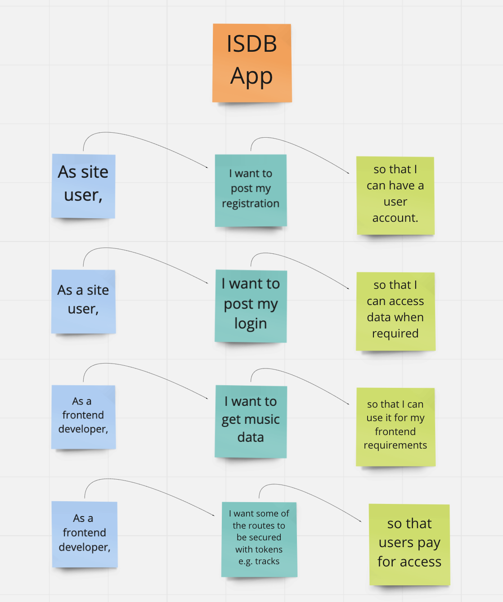
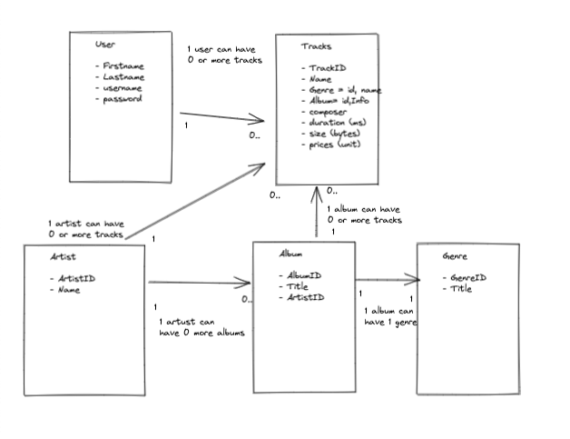
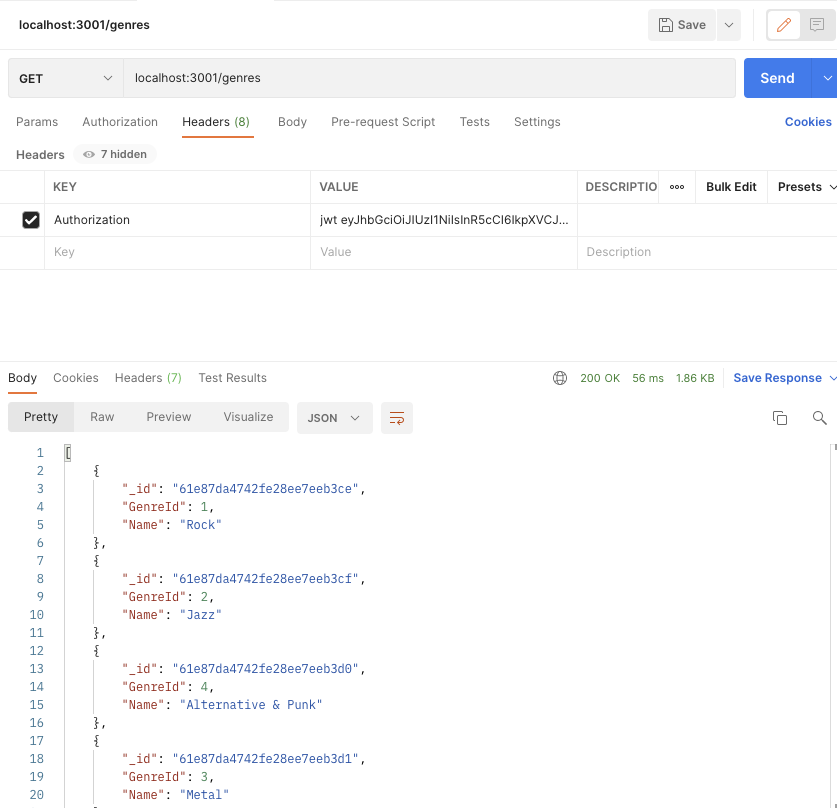

# ISDB-App

> This project follows on from IMDB (Internet Movie Database), launching and plan to sell on an ISDB API (Internet Song Database). The API provides access to a collection which includes more than 3000 tracks from 300+ albums.
> Live demo [_here_](https://deploy-isdb.herokuapp.com/).

## Table of Contents

- [General Info](#general-information)
- [Technologies Used](#technologies-used)
- [Features](#features)
- [Screenshots](#screenshots)
- [Setup](#setup)
- [DevelopmentStage](#Development-stage)
- [Usage](#usage)
- [Project Status](#project-status)
- [Room for Improvement](#room-for-improvement)
- [Acknowledgements](#acknowledgements)
- [Contact](#contact)
<!-- * [License](#license) -->

## General Information

> Purpose of the project is to design an API so the client can access the database. This is so customers can build various front ends needed to use the database. The API includes token based authentication to ensure people pay for access.
> User Story:-
> [_here_](https://miro.com/app/board/uXjVOVHkNlY=/)
> This API provides the following endpoints:-

- /register
- /login
- /tracks/:id
- /genres
- /albums
- /tracks
- /artists/:id

## Technologies Used

- Node.js
- MongoDB
- Mongoose
- Express
- EJS
- eslint

## Features

List the ready features here:

- View the list of Albums by specifying the id.
- Protected endpoints using token based authentication.
- User password is not stored as a string but is hashed instead.

## Screenshots

## Setup

Project Deliverables

- A running Express/Mongo application deployed on heroku/mongodb with the mentioned routes and the data loaded in.
- A GitHub repo that includes README file.
- Supporting documentation and code.

Install / setup one's local environment / get started with the project.

- Install the project requires a connection string of the local host or MongoDb deployment.
- Once connected a few installations were carried out before the API was built. See below
- Using terminal:-
- Scaffold an express application `npm install -g express-generator` and launch VS code.
- Without going through all the steps install npm project `npm init -y`.
- Installed nodemon in the dev enviroment as it's not required in global enviroment during production `npm install --save-dev nodemon`
- Installed eslint used in two cases, adhere to set standard and how it was violated.
- Run npm start.
- Use postman see to see the results for example to view the genres (see) ensure to use the token received when logged in. Under header specify the key: Authorisation and value: jwt [token key]. This will display the array of genres.

## Development Stage

15/01/22

1. What have you done so far

- Created the ISDB express app on vs code.
- Sketched a model diagram for the schema.
- Started user stories.
- Deployed express App using Mongodb Atlas and Heroku

2. What are you going to work on next

- Implement project data and create entities for users, tracks, albums, artists and genres.
- Define and create a Schema and model with reference to the model diagram.
- Upload data .csv files using mongorestore
- Create ejs files.

3. What blockers you have (if any)

- Create user stories for API.

16/01/22

1. What have you done so far

- Implement project data and create entities for tracks.
- Define and create a Schema and model for tracks with reference to the model diagram.

2. What are you going to work on next

- Implement project data and create entities for albums, artists and genres.
- Define and create a Schema and model with reference to the model diagram for all entities.
- Upload data .csv files using mongorestore
- Removed unused code using eslint.
- Create ejs files.

3. What blockers you have (if any)

- App Error when launching it. Going through github commits to see if changes caused the error. Error caused due to tracks.js model code.
- Error received when uploading data using mongorestore. Used mongoimport to upload all csv files.

17/01/22

1. What have you done so far

- Upload data .csv files using mongoimport in the correct connection string.
- Look into user entity, fix the error on user model.
- Removed unused code using eslint.

2. What are you going to work on next

- Look into the rest of the endpoints to ensure all endpoints protected.
- Define and create a Schema and model with reference to the model diagram for all entities.
- Update routes with required methods.

3. What blockers you have (if any)

18/01/22

1. What have you done so far

- Define and create a Schema and model with reference to the model diagram for all entities.
- Update routes with required methods.

2. What are you going to work on next

- Fixed error with Routes by changing the mongodb connection from localhost to loopback address. Which showed the data such as album information.
- Look into the rest of the endpoints to ensure all endpoints protected.

3. What blockers you have (if any)

- Debugged multiple reference and type errors.
- One particular type Error `jwtFromRequest: passportJwt.ExtractJwt.fromAuthHeaderWithScheme('jwt'),` was undefined which caused delay in moving to the next step.
- Error with Routes unable to show data such as album information.

20/01/22

1. What have you done so far

- Fixed error with Routes by changing the mongodb connection from localhost to loopback address. Which showed the data such as album information.

2. What are you going to work on next

- API documentation using swagger.

3. What blockers you have (if any)

- Unable to display successful login due to endpoint error when specifying /users instead required /login.
- Following from above, the login parameters included req.param.username which was changed to req.body.username.

21/01/22

1. What have you done so far

- API documentation using swagger.
- Generated token for login page using authentication.

2. What are you going to work on next

- Look into the rest of the endpoints to ensure all endpoints protected.
- Setup user password to use Salt and Hash.

3. What blockers you have (if any)

21/01/22

1. What have you done so far

- Looked into the rest of the endpoints to ensure all endpoints protected.
- Ensured user password used Salt and Hash.

2. What are you going to work on next

3. What blockers you have (if any)

## Usage

How does one go about using it?

- Can be used via Postman. This can be done via the deployment url specified in the introduction.

Provide various use cases and code examples here.

- For example, this can be used when trying to find an array of genres:-
  `router.get('/', (req, res) => { Genre.find({}, function (error, genres) { if (error) { res.status(400).json({ message: ({ message: 'Unable to find Genre'}) }); } else { res.status(200).json(genres); } }); });`
- For example, this can be used when trying to find a specific Album by specifing the id e.g https://deploy-isdb.herokuapp.com/albums/2:-
  `router.get('/:AlbumId', (req, res) => { Album.findOne ({ AlbumId: parseInt(req.params.AlbumId) }, function (error, album) { if (error) { res.status(400).json({ message: ({ message: 'Unable to find Album'}) }); } else { res.status(200).json(album); } }); });`

## Project Status

Project is: _in progress_ / _complete_

## Room for Improvement

Room for improvement:
While trying to get the application to work without errors or bugs and I ran out of time. So listed below some improvements to the application.

- Refactor code.
- Implement a creative feature to the project such as being able to add, update, delete songs and a views using EJS files.

## Acknowledgements

This project was based on class tutorials

- Introduction to MongoDB.
- Introduction to Express and Mongoose.
- Creating an API with Express & Mongoose.
- API Authentication.
- API Documentation.

Other resources used for the project include : -

- [MongoDB](https://www.mongodb.com/developer/article/mongoose-versus-nodejs-driver/).
- [Mongoose](https://mongoosejs.com/docs/guide.html).
- [Queries](https://mongoosejs.com/docs/queries.html).
- [Models](https://mongoosejs.com/docs/models.html).
- [Express-Middleware](https://expressjs.com/en/resources/middleware.html).
- [Server-Side-Express](https://developer.mozilla.org/en-US/docs/Learn/Server-side/Express_Nodejs/mongoose).
- [HTTP-response-status-code](https://developer.mozilla.org/en-US/docs/Web/HTTP/Status).
- [Swagger](https://swagger.io/specification/).

## Contact

Created by [Stanton]() - feel free to contact me!
